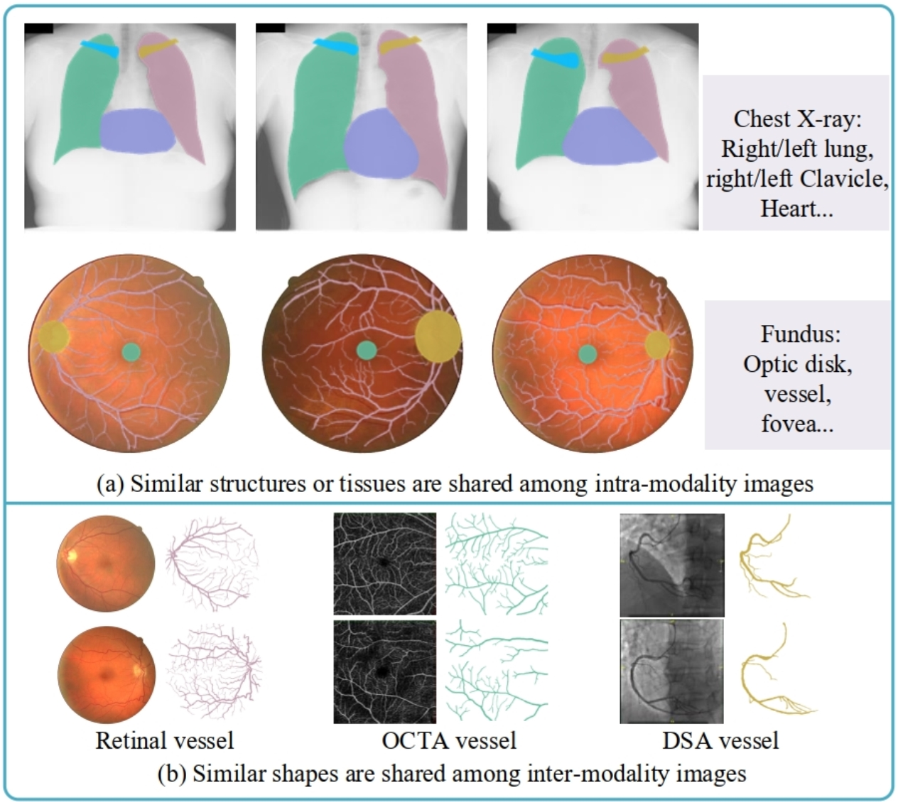

# Local Discriminative Representation Learning
Pytorch code for Unsupervised Local Discrimination for Medical Images. [(arXiv)](https://arxiv.org/abs/2108.09440)  
It is an extension of our previous work acceptted by [(IPMI 2021)](https://link.springer.com/chapter/10.1007/978-3-030-78191-0_29).

## Highlights
The goal of this work is to learn local discriminative representation for medical images and explore its medical applications. Medical images commonly have the following two properties, 1) intra-modality structures similarity (i.e medical images of human contain similar anatomical structures), and 2) inter-modality shape similarity (i.e anatomical structures among different modalities may have similar shape knowledge).  

  
Based on these two facts, we systematacially propose a local discriminative representation framework, which can measure pixel-wise, region-wise and patch-wise similarity for medical images. There are mainly three highlights:

1. Based on the priori knowledge that medical images of human share similar anatomical structures, we propose a unsupervised deep learning framework to learn discriminative features and cluster similar regions. In this framework, two branch, including an embedding branch to embed each pixel and a clustering branch to cluster similar regions. In the embedding space, pixels of similar structures should be closely distributed. The learnt representation can be a good initialization for corresponding down-streams.  
  
2. Similar shape priors are shared among different medical images, and it is easy for specialists to identify target anatomical structures based on this prior knowledge. Based on this fact, we add priors to guide cluster branch to cluster specific regions. And we successfully utilize the shape prior of OCTA or OCTA to guide the segmentation of color fundus vessel.  
  
3. The ability of patch-wise discrimination inspires us to implement the learnt representation to one-shot localization. To realize this, we introduce center-sensitive ability into the framework to make the detected target center more accurate.  
  

## Usage

- Prerequisites:xxx 
- Clone this repo: git clone https://github.com/HuaiChen-1994/LDLearning.git.
- Dataset preprocessing: total 14 open dataset should be downloaded and preprocessed. Please follow ./dataset/ReadMe.txt to finish this step.  

### Part1: local discriminative representation learning  
We only take the code of retinal images as an example, then, the implementation in X-ray is similar to this processing.  
The code of this part is in ./retinal code/step1_ld_pretraining (or ./X-ray code/step1_ld_pretraining).  
1) Set the experimental parameters in ./retinal code/step1_ld_pretraining/args_setting.py according to the detail explanations in this file (GPU id, batch-size, et.al.).  
2) Patch discrimination learning to learn initial discriminative representations. cd to ./retinal code/step1_ld_pretraining/, then, python step1_train_pd_mixup.py.
3) Local discrimination learning python step2_train_ld.py.  
The codes for downstram tasks are in ./retinal code/step2_downstream_tasks, run STEP1_transfer.py and STEP2_random_initialization.py.  

### Part2: shape-guided segmentation  
1) Set the experimental parameters in ./retinal code/step3_shape_guided_segmentation/args_setting.py
2) cd to the path of ./retinal code/step3_shape_guided_segmentation. python step1_train_pd_mixup.py;python step2_train_with_shape_prior.py;python step3_test_segmentation.py.
